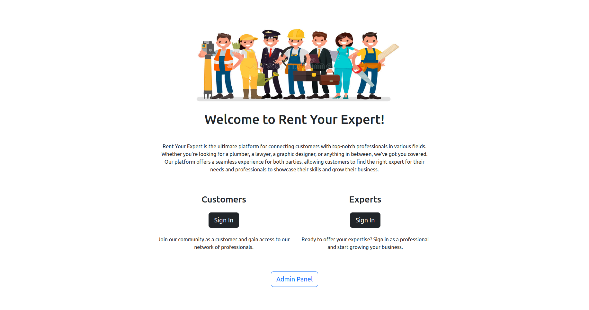
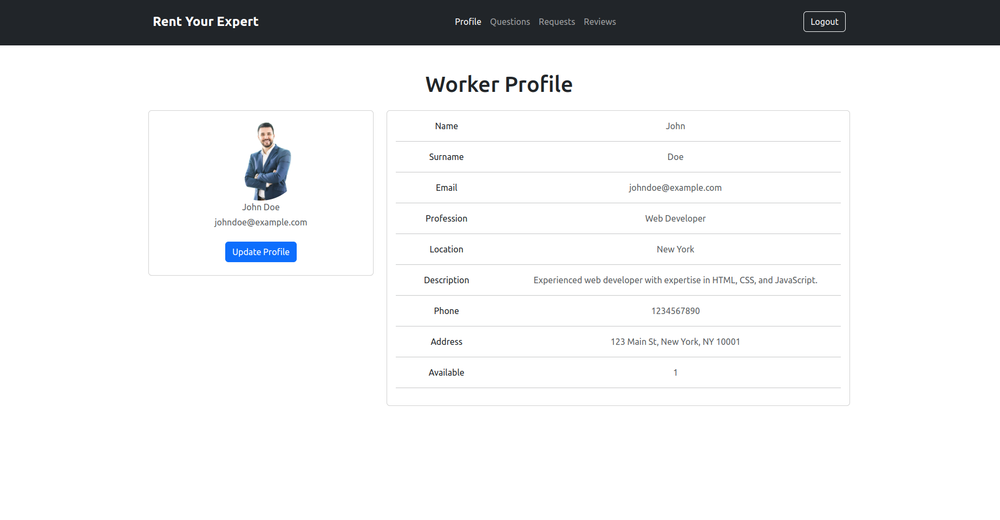

## RentYourExpert
RentYourExpert is a platform that connects individuals who require expert services with skilled professionals across various fields.

  

## Key Features
- **User-friendly Interface:** The app is designed to be easy to navigate, allowing users to quickly find the information they need.
- **Search Functionality:** Users can search for workers based on their skills and location.
- **Secure User Authentication and Authorization:** Robust measures ensure the security of user access.
- **Worker Reviews:** The platform displays worker reviews, helping clients make informed decisions when hiring a worker.
- **Efficient Communication:** A built-in Q&A system makes it easy for both parties to discuss project requirements and expectations.
- **Easy-to-Use Profile Management:** Workers can efficiently manage their profiles, projects, and communication with clients through an intuitive interface.

  

## Technologies Used
- React &#8594; Frontend
- Flask &#8594; Backend
- MySQL &#8594; Database Management System
- Docker &#8594; Containerization

## Development Methodology
- Agile
- Scrum
- REST APIs

**User Stories and Metrics:**
- We defined the requirements of the application through a total of 25 user stories, documented in the provided spreadsheet.

**Complexity Estimation:**
- We estimated the complexity of software development, time, and effort using Function Points and COCOMO II methods.

**Sprint Overview:**
- **Sprint 1:** Focused on defining the project's structure and learning how to work with the new technologies used.
- **Sprint 2:** Involved the addition of most microservices and frontend development. It was the most time and effort-intensive part of development.
- **Sprint 3:** Required less effort, focusing on completing the application and leveraging our experience with the adopted technologies.

## How to Run
1. Clone the repository: `git clone https://github.com/aloilor/rentyourexpert.git`
2. Navigate into the folder:  `cd /rentyourexpert/ `
3. Run  `docker compose build` to build the image container
4. Run  `docker compose up` to start the container
5. Access the application by visiting http://localhost:3000 in your web browser

## Learn More
For a detailed overview of RentYourExpert's development process and design, please check out our [Canva presentation](https://www.canva.com/design/DAFegq7cqAs/xs79qSubU77cN-Ze8SJBHg/edit?utm_content=DAFegq7cqAs&utm_campaign=designshare&utm_medium=link2&utm_source=sharebutton).
